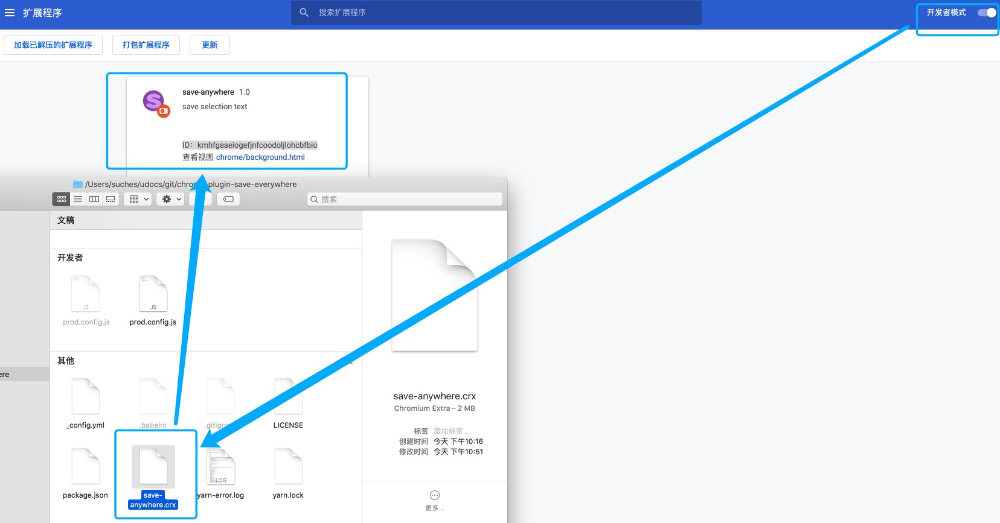
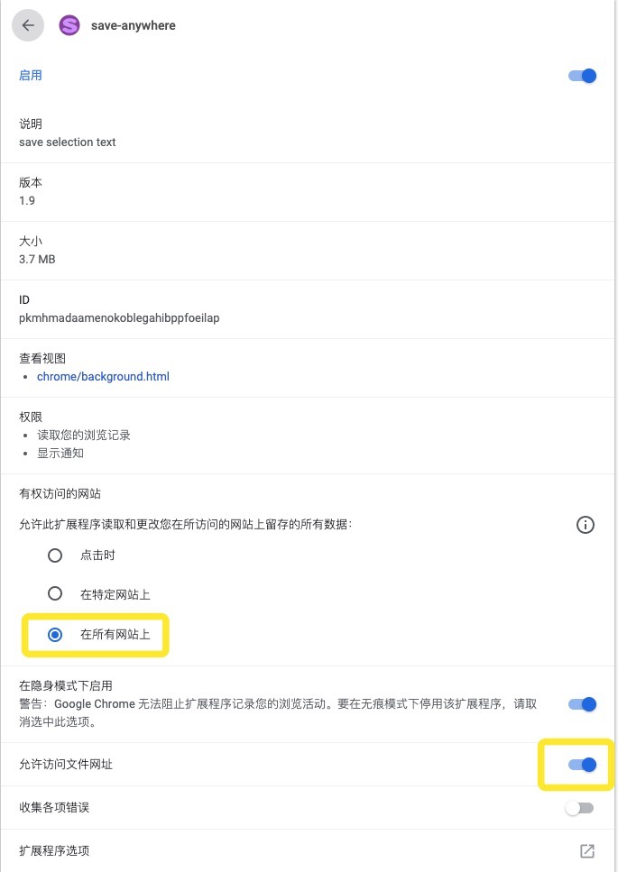
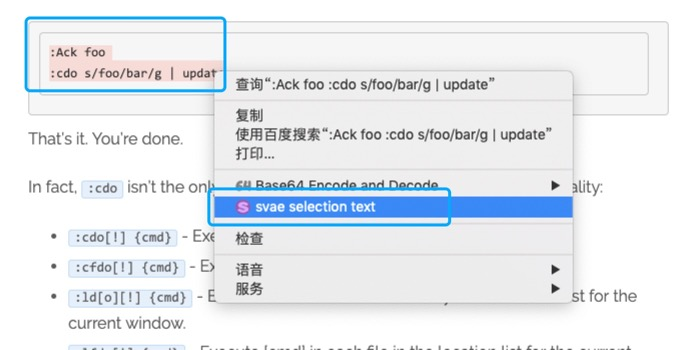
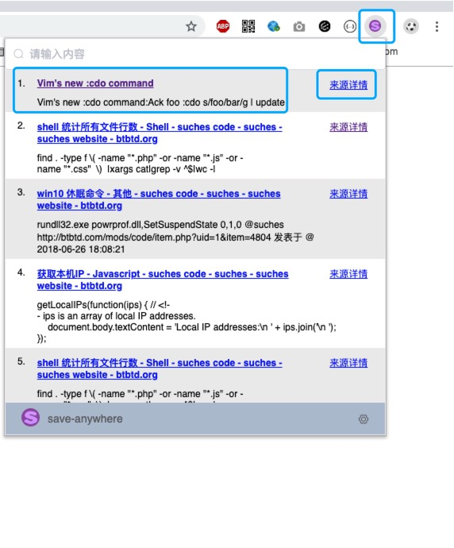
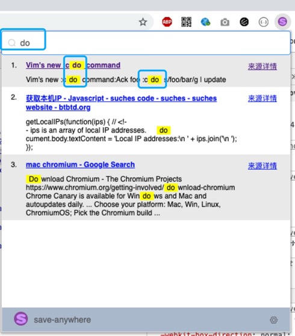
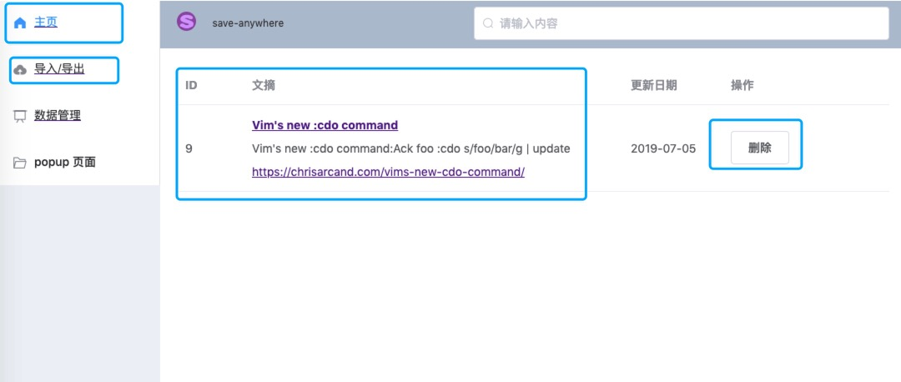

# chrome 浏览器插件 save-anywhere

save-anywhere 可以右键保存选中的文本，存储到浏览器本地的 indexedDb

如果需要同步不同机器保存的内容，需要使用 github oauth 登陆授权，然后使用同步功能即可同步不同机器保存的内容 

# 如何使用

## step 1 - 下载插件

### 从 github 下载 save-anywhere 浏览器插件 离线安装包

[save-anywhere.crx](https://raw.githubusercontent.com/hnjd-fe/chrome-plugin-save-anywhere/master/save-anywhere.crx)

### 从 chrome 应用商店下载 save-where 浏览器插件

[save-anywhere](https://chrome.google.com/webstore/detail/save-anywhere/pkmhmadaamenokoblegahibppfoeilap?hl=zh-CN)

## step 2 - 安装 save-anywhere 浏览器插件

## step 2.1 - 设置插件访问权限（进入插件详情页面，文件访问开关设置为开，文件访问只有为开才能保持文本换行格式 ）

## step 3 - 保存选中的文本（右键选择需要保存的文本，然后在弹出的菜单里点击 "save selection text"）

## step 4 - 从插件弹框里获取最新保存的内容（插件弹框默认显示最近保存的50条数据）

## step 5 - 快速获取保存的内容（在插件弹框最上方的搜索框输入相关内容进行搜索）

## step 6 - 查看保存内容的详情（点击插件弹框可以跳转到内容详情页）

# 开发插件 

## 初始化（进入到插件代码根目录，使用 yarn 初始化开发依赖）
  yarn
  
## 运行本地开发环境
  yarn serve 
  
  http://localhost:8080/index.html
  
  http://localhost:8080/popup.html
  
## 发布代码
  yarn build 
  
  //output dir: ./save-anywhere/
